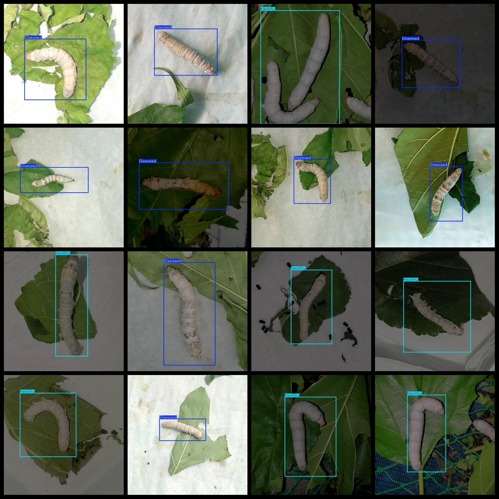

# This dataset is a collection of 10,197 images labeled as "healthy" or "unhealthy." The images are in the VOC+YOLO format, which means they have both the VOC (Visual Object Classes) and YOLO (You Only Look Once) labels.

The silkworm health status detection dataset contains 10197 images in both VOC+YOLO format. The dataset is organized as follows:

- Pascal VOC format + YOLO format (txt files without split paths, only containing jpg images along with their corresponding VOC format xml files and YOLO format txt files)

Number of images (jpg file count): 10197

Number of annotations (xml file count): 10197

Number of annotations (txt file count): 10197

Number of annotation categories: 2

Repository location: datasets_sl

Annotation category names according to the labels folder's classes.txt: ["Diseased", "Healthy"]

Each category has the following number of bounding boxes:

- Diseased bounding box count = 5588
- Healthy bounding box count = 6780
- Total bounding box count = 12368

Each category occupies the same number of images:

- Diseased image count = 5256
- Healthy image count = 5259

Image resolution: 640x640

Used labeling tool: labelImg

Dataset is enhanced: Yes

Annotation rules: Draw a rectangle around the category

Important note: The dataset does not have been divided into training, validation, or test sets; users need to do so themselves.

Special declaration: This dataset does not guarantee any accuracy for models trained on it or weight files.

Annotation and image details are as follows:

## Images

---

Here is a pay link on Stripe (https://buy.stripe.com/3cs8yP7sY87d0vu9AB). Please contact me lonlonago@foxmail.com after funding $89, and I will send you a complete data files, thank you!

